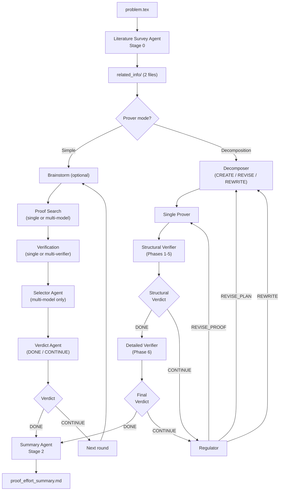

# QED

**Authors:** Chenyang An (<cya.portfolio@gmail.com>) Qihao Ye (<q8ye@ucsd.edu>) Minghao Pan (mpan2@caltech.edu)

QED is a multi-agent pipeline that takes a mathematical problem statement in LaTeX and produces a rigorous natural-language proof. The pipeline orchestrates Claude (and optionally Codex and Gemini) through their respective CLIs via bash subprocesses — no agent framework is used. Both proof search and verification can use any configurable subset of models (Claude, Codex, Gemini) running in parallel. It performs stronger than chatbot versions of various models on math proving tasks, since it uses agentic loops to search and verify math proofs instead of answering in one shot.

<picture>
  <source media="(prefers-color-scheme: dark)" srcset="https://api.star-history.com/svg?repos=proofQED/QED&type=Date&theme=dark" />
  <source media="(prefers-color-scheme: light)" srcset="https://api.star-history.com/svg?repos=proofQED/QED&type=Date" />
  
</picture>

## Math Research Problems that are solved by QED, verified by domain experts.

1. QED successfully finds a smooth space–time weight function (with auxiliary parameters) for the wave operator on a half-infinite domain such that it satisfies global pseudoconvexity, growth, and positivity constraints required to validate a Carleman estimate, and gives proofs that characterize the admissible parameter regime ensuring these conditions hold. (GitHub link will be released soon after paper arxived).

   **Math work experts:** The mathematical side of this problem — including formulating the question, verifying the QED-generated proof, and other dependent mathematical work — was done by Qiao Zhuang (University of Missouri-Kansas City), Qihao Ye (University of California, San Diego), and Zhongqiang Zhang (Worcester Polytechnic Institute).

   **Expert comment (Qiao Zhuang, Qihao Ye, Zhongqiang Zhang):** The use of LLM-based search aims to replace the traditional hand-crafted process of identifying suitable Carleman weight functions for deriving Carleman estimates. This process is often difficult, highly problem-dependent, and time-consuming, and may still fail to produce a valid construction through manual trial. By automating the search over admissible weight functions under the required structural and inequality constraints, the approach has the potential to systematically explore viable candidates, thereby reducing reliance on ad hoc intuition and extensive analytical effort. This is particularly important for inverse problems, where the construction of an appropriate Carleman weight is a central and highly nontrivial step that directly impacts stability and uniqueness results. An LLM-assisted search framework can help identify feasible weight structures, guide the design of admissible functions, and accelerate the development of Carleman-based methodologies, thereby extending their applicability to more complex or less structured problems.

   **What actually happens:** Experts gave QED the problem: finding the function that satisfies the constraints. QED returned a candidate with proof. Experts found that the constraints are too weak (they initially gave the wrong problem). Experts strenghthened the constraints, gave the problem back to QED, and instructed QED to continue search, starting with the previous candidate generated by QED. QED then returned the final candidate and the proofs. In the entire loop, no human intervention besides experts changed their problem statement once. 


## How It Works

The pipeline runs in three stages. All model invocations are done by spawning CLI subprocesses (`claude -p`, `codex exec`, `gemini -p`) — the pipeline reads their JSON stdout for token tracking and passes prompts as command-line arguments.

**Stage 0 — Literature Survey.** A survey agent reads the problem and first evaluates its difficulty (Easy / Medium / Hard), then conducts an investigation of the mathematical landscape scaled to that difficulty: classifying the problem, identifying applicable theorems, and cataloguing related results. Easy problems get a brief survey; hard problems get the full treatment. The results are saved to `related_info/` for the proof agent to reference. The survey agent does NOT produce proof strategies — that is the proof search agent's job.

**Brainstorm session (optional).** When `brainstorm.enabled` is true, multiple models independently brainstorm proof strategies in parallel before each proof search round. Each model reads the problem, related work, and previous round's proof and verification feedback, then proposes short, high-level strategy ideas. The proof search agent reads all brainstorm results as inspiration. This increases diversity of proof approaches and helps break fixation when the prover is stuck. Brainstorm is skipped for easy problems.

**Stage 1 — Proof Search Loop.** An iterative loop runs up to `max_proof_iterations` rounds (default 9). The behavior adapts to the problem's difficulty.

Model selection is **solely determined by configuration** — the `multi_model.providers` list controls which models run proof search, and `verification_agents.providers` controls which models run verification. Difficulty classification affects only the survey depth and verification thoroughness, not which models are used.

**Multi-model proof search + multi-model verification — 4 to 5 steps per round (parallel):**

1. **Proof Search (parallel)** — All configured proof search providers (any subset of Claude, Codex, Gemini) attack the problem simultaneously. Each writes its own `proof.md` in an isolated subdirectory.
2. **Verification (parallel, multi-verifier)** — Each proof is independently verified by ALL configured verification providers using direct verification. For N proofs and M verifiers, this produces N×M verification reports. Each verification result is saved as `verification_result_<verifier>.md` in the respective proof subdirectory.
3. **Selector Agent** — Reads all verification reports across all proofs and verifiers. Selects the single most promising proof based on: unanimous verifier agreement, problem-statement integrity, overall verdict, fewest failures, quality of partial progress, and structural completeness. A proof needs PASS from ALL verifiers to be considered fully verified. Writes `selection.md`. *(Skipped when only one proof search provider is configured — the single proof is used directly.)*
4. **Apply Selection** — The winning proof is copied to the main `proof.md`.
5. **Verdict Agent** — Reads all verification reports for the selected proof and returns `DONE` only if ALL verifiers passed, otherwise `CONTINUE`.

**Single-model proof search + single-model verification — 3 steps per round:**

1. **Proof Search Agent** — Reads the problem, the literature survey, any previous-round feedback, and any human prover guidance from `human_help/`. Writes or refines a complete natural-language proof in `proof.md`.
2. **Verification Agent** — Directly verifies the proof for logical validity, mathematical correctness, computational checks, problem-statement integrity, and structural completeness. Writes `verification_result.md`.
3. **Verdict Agent** — Reads the verification result and returns `DONE` or `CONTINUE`.

**Easy problems — 3 steps per round:**

1. **Proof Search Agent** — Same as above.
2. **Verification Agent (lightweight)** — Does a lightweight direct read-through checking logical flow, correctness, completeness, and problem-statement integrity. Writes `verification_result.md`.
3. **Verdict Agent** — Same as above.

If the verdict is `DONE`, the pipeline stops. Otherwise the next round begins, with the proof search agent reading the previous round's verification feedback and proof status log to avoid repeating failed approaches.

### Decomposition Mode (alternative to simple mode)

When `prover.mode` is set to `"decomposition"` in `config.yaml`, the pipeline replaces the simple proof search loop (Stage 1) with a structured decomposition-based prover. Instead of one agent iterating on a single proof, five specialized agents collaborate through a plan-prove-verify-regulate cycle. This mode is designed for harder problems where a top-down decomposition into intermediate claims helps organize the proof effort.

**Five agents, each independently configurable to use Claude, Codex, or Gemini:**

| Agent | Config key | Role |
|-------|-----------|------|
| **Decomposer** | `decomposition.models.decomposer` | Creates a YAML proof plan — a DAG of intermediate claims from literature sources to the target |
| **Single Prover** | `decomposition.models.single_prover` | Writes a complete proof following the decomposition plan |
| **Structural Verifier** | `decomposition.models.structural_verifier` | Structural verification (Phases 1–5): problem integrity, completeness, citations, decomposition adherence, additional rules |
| **Detailed Verifier** | `decomposition.models.detailed_verifier` | Detailed verification (Phase 6): step-by-step mathematical correctness of each decomposition step |
| **Regulator** | `decomposition.models.regulator` | Analyzes verification failures and decides next action |
| **Verdict** | `decomposition.models.verdict` | Returns DONE/CONTINUE based on verification reports |

**The decomposition plan** is a structured YAML document containing:
- `sources` — Known results from the literature survey that serve as building blocks, each with a `<cite>` block.
- `steps` — Intermediate claims that chain from sources to the target. Each step has: an `id`, a precise quantitative `statement`, `inputs` (dependencies), `difficulty` rating, `is_key_step` flag, `rationale`, and `strategy_hint`.
- `target` — The original conjecture, with `inputs` listing the final steps that prove it.
- `proof_order` — Topological ordering for proving steps.
- `key_steps` — IDs of the most novel/difficult steps, which the prover gives extra attention.
- `self_critique` — The decomposer's own plausibility checks, contradiction checks, and difficulty assessment.

The decomposer enforces a strict rule: every step must be a **rigorous quantitative mathematical statement**, not a vague description (e.g., "For all t > 0, E[e^{tX}] ≤ e^{t²σ²/2}" rather than "X has a thin tail").

**Three-level retry hierarchy controlled by the Regulator:**

The regulator agent analyzes verification failures and chooses one of three escalation levels:

1. **REVISE_PROOF** — Keep the same decomposition plan, try a different proof execution. Used when the plan is sound but the prover made execution errors (computational mistakes, missed edge cases, hand-waving). Limited to `max_proof_attempts` per revision (default: 2).

2. **REVISE_PLAN** — Modify the decomposition plan locally, then re-prove. Used when verification reveals structural gaps in the plan (missing intermediate claims, incorrect dependencies, overly ambitious steps). Limited to `max_revisions` per attempt (default: 2).

3. **REWRITE** — Abandon the current proof strategy entirely and create a new decomposition from scratch. Used when the fundamental approach is flawed. Limited to `max_decompositions` total (default: 2).

When a lower-level limit is exhausted, the system automatically escalates: exhausted proof attempts trigger a plan revision, exhausted revisions trigger a rewrite.

**Pipeline flow:**

```
Decomposer (CREATE) → Single Prover → Structural Verifier → Verdict
     ↑                                                        |
     |                                   DONE ←───────────────┤
     |                                                        |
     |                                   CONTINUE ────────────┘
     |                                        |
     |                               Detailed Verifier → Verdict
     |                                                    |
     |                               DONE ←──────────────┤
     |                                                    |
     |                               CONTINUE ───────────┘
     |                                     |
     └──────────── Regulator ←─────────────┘
                   (REVISE_PROOF / REVISE_PLAN / REWRITE)
```

When structural verification fails, the pipeline skips detailed verification entirely and goes straight to the regulator — there is no point doing expensive step-by-step analysis on a structurally unsound proof.

**Resume support.** The decomposition prover has its own resume detection. It scans the `decomposition/` directory structure (attempt → revision → proof) and detects exactly where the previous run stopped: mid-decomposition, mid-proof, mid-verification (structural or detailed), or mid-regulation. It restores the full state (attempt/revision/proof counters, decomposition plan, attempt history) and continues from the exact interruption point.

**Failure analysis.** When all retry limits are exhausted, the regulator runs in FINAL mode — it writes a comprehensive failure analysis (`decomposition/failure_analysis.md`) summarizing all attempts, the pattern of failures, and insights for human intervention.

**Directory structure:**

```
<output>/decomposition/
├── STATUS.md                              # Current state (attempt, revision, proof, activity)
├── log.txt                                # Timeline log of all agent calls
├── failure_analysis.md                    # Written when all limits exhausted
├── attempt_1/
│   ├── revision_1/
│   │   ├── decomposition.yaml             # The proof plan
│   │   ├── decomposer_response.md         # Raw decomposer output
│   │   ├── proof_1/
│   │   │   ├── proof.md                   # Complete proof
│   │   │   ├── prover_response.md         # Raw prover output
│   │   │   ├── scratchpad.md              # Prover's scratch work
│   │   │   ├── structural_verification.md # Phases 1–5 report
│   │   │   ├── detailed_verification.md   # Phase 6 report
│   │   │   └── regulator_decision.md      # REVISE_PROOF / REVISE_PLAN / REWRITE
│   │   └── proof_2/                       # After REVISE_PROOF
│   │       └── ...
│   └── revision_2/                        # After REVISE_PLAN
│       ├── decomposition.yaml             # Revised plan
│       └── proof_1/
│           └── ...
└── attempt_2/                             # After REWRITE
    └── revision_1/
        ├── decomposition.yaml             # Completely new strategy
        └── ...
```

**Stage 2 — Proof Effort Summary.** After the proof loop finishes (either success or max iterations), a summary agent reads all generated files and writes `proof_effort_summary.md`.

All agents receive `skill/super_math_skill.md` as a system-level instruction — a guide to mathematical proof methodology covering proof orientation, core strategies, stuck-recovery tactics, self-checking discipline, and computational tool usage. The proof search agent also receives the skill file path as an explicit input (`{skill_file}`) so it can reference the strategies directly.

**Structured tags.** The proof search agent is required to use two structured tag formats in the proof, which the verification agent checks:

- **`<cite>...</cite>`** — Every external mathematical result (theorem, lemma, etc.) must be cited with a structured block containing: type, label, title, authors, source URL, verifier locator, exact statement, and usage. The verification agent independently checks each citation's faithfulness — fetching the source URL, verifying the statement matches, and confirming the result is correctly applied.
- **`<key-original-step>...</key-original-step>`** — Every nontrivial, original step in the proof (novel reductions, hard estimates, key constructions) must be wrapped in this tag. The content inside must be maximally detailed with no hand-waving. The verification agent independently identifies which steps it considers nontrivial and flags mismatches: untagged hard steps (prover hiding difficulty) or inflated tags (prover tagging routine steps as key).

**Verification phases.** Verification is split across two prompt files:

`proof_verify_structural.md` (Phases 1–4):

1. **Phase 1: Problem-Statement Integrity** — Word-by-word comparison of the original problem vs. what the proof claims to prove.
2. **Phase 2: Citation Verification** — Checks every `<cite>` block for correct format, then independently verifies faithfulness (URL works, statement matches source, usage is correct). Models routinely hallucinate citations.
3. **Phase 3: Subgoal Tree Structure** — Validates the proof's subgoal decomposition tree for completeness and well-formedness.
4. **Phase 4: Additional Verification Rules** — Applies human-provided verification criteria from global and per-round rule files. Each rule is treated as a hard requirement.

`proof_verify_detailed.md` (Phase 5):

5. **Phase 5a: Logical Step Verification** — Fine-grained step-by-step verification with computational checks.
6. **Phase 5b: Subgoal Resolution** — Checks that every subgoal identified in Phase 3 is fully resolved.
7. **Phase 5c: Key Original Step Analysis** — `<key-original-step>` mismatch analysis: untagged hard steps, inflated tags.
8. **Phase 5d: Coverage** — Chain completeness, problem-proof alignment, and coverage checks.

**Human guidance.** There are two channels of human guidance, each with a global and per-round level:

**Prover guidance** (read by the proof search agent):

1. **Global prover guidance** (`human_help/additional_prove_human_help_global.md`) — Persistent hints that apply across all rounds. You can update this file at any time during a run.
2. **Per-round prover guidance** (`verification/round_N/human_help/additional_prove_human_help_per_round.md`) — Round-specific feedback. After reviewing round N's results, write targeted feedback here; round N+1's proof search agent will read it alongside the global file.

**Verification rules** (read by the structural verification agent):

1. **Global verification rules** (`human_help/additional_verify_rule_global.md`) — Persistent additional verification criteria that apply across all rounds. The structural verifier treats every rule in this file as a hard requirement.
2. **Per-round verification rules** (`verification/round_N/human_help/additional_verify_rule_per_round.md`) — Round-specific verification criteria. After reviewing round N's results, write targeted rules here; round N+1's structural verifier will read them alongside the global rules.

Each round's `human_help/` directory is created automatically when the round starts. The proof search agent reads both prover guidance sources at the start of every round. The structural verifier reads both verification rule sources. Per-round guidance is especially useful for pointing out specific errors in the previous round's proof or adding verification checks based on what you observed.

**Resume support.** If the pipeline is interrupted and re-run with the same output directory, it automatically detects prior progress: skips the literature survey if complete, detects which step within a round was last completed (including parallel steps), cleans up incomplete state, restores `proof.md` from backup if needed, and resumes from exactly where it left off. Resume detection respects the multi-verifier configuration — verification is only considered complete when ALL expected verification files exist (one per configured verifier per configured proof provider).

**Post-call file checks.** After every agent call, the pipeline verifies that all expected output files were created (proof, proof status, verification result, error log, etc.). If any expected file is missing, the pipeline logs a fatal error and stops immediately — it does not silently continue with missing artifacts.

**Error handling.** When a model runner (Claude, Codex, or Gemini CLI) fails, the pipeline logs detailed error information including: provider name, error type (subprocess error, non-zero exit code, or empty response), exit code, stderr output, and stdout output. This helps diagnose issues with specific providers during multi-model runs.

**Smoke test.** `run.sh` automatically runs the smoke test before the pipeline starts. The smoke test validates prompts, skills, Claude connectivity, and — when multi-model is enabled — Codex and Gemini connectivity. If any test fails, the pipeline does not start.

Token usage is tracked across all agent calls and all providers, written to `TOKEN_USAGE.md` and `token_usage.json` after every call. When multiple providers are used, a per-provider summary table is included.

## File Structure

```
proof_agent/
├── README.md                          # This file
├── config.yaml                        # Pipeline, Claude, Codex, Gemini configuration
├── run.sh                             # Entry point (runs smoke test, then pipeline)
├── .gitignore
│
├── code/
│   ├── pipeline.py                    # Main orchestrator (all stages, logging, token tracking)
│   ├── model_runner.py                # Unified async wrappers for Claude, Codex, Gemini CLIs
│   ├── decomposition_prover.py        # Decomposition-based prover (5-agent plan-prove-verify-regulate cycle)
│   └── smoke_test.py                  # Validation (prompts, skills, connectivity for all enabled models)
│
├── prompts/
│   ├── literature_survey.md           # Stage 0: literature survey agent prompt
│   ├── brainstorm.md                 # Stage 1 (simple): brainstorm session prompt (optional)
│   ├── proof_search.md               # Stage 1 (simple): proof search agent prompt
│   ├── proof_verify_structural.md    # Stage 1 (simple): structural verification prompt (Phases 1-4)
│   ├── proof_verify_detailed.md      # Stage 1 (simple): detailed verification prompt (Phase 5)
│   ├── proof_verify_easy.md          # Stage 1 (simple): lightweight verification prompt (easy)
│   ├── proof_select.md              # Stage 1 (simple): selector agent prompt (multi-model only)
│   ├── verdict_proof.md              # Stage 1 (simple): verdict agent prompt
│   ├── proof_effort_summary.md       # Stage 2: proof effort summary agent prompt
│   └── decomposition-prover/         # Stage 1 (decomposition mode) prompts
│       ├── decomposition.md           #   Decomposer: CREATE / REVISE / REWRITE proof plans
│       ├── single_prover.md           #   Single prover: writes complete proof from plan
│       ├── proof_verify_structural.md #   Structural verification (Phases 1-5, decomposition-aware)
│       ├── proof_verify_detailed.md   #   Detailed verification (Phase 6, step-by-step)
│       ├── regulator.md               #   Regulator: REVISE_PROOF / REVISE_PLAN / REWRITE decisions
│       └── verdict_proof.md           #   Verdict: STRUCTURAL or FINAL mode DONE/CONTINUE
│
├── problem/
│   └── problem.tex                    # Placeholder — put your problem statement here
│
├── human_help/
│   ├── additional_prove_human_help_global.md   # Prover hints/suggestions (all rounds)
│   └── additional_verify_rule_global.md        # Extra verification rules (all rounds)
│
└── skill/
    └── super_math_skill.md            # System prompt: principles for proof construction
```

### Prompt Templates

Each prompt file in `prompts/` is a Markdown template with `{placeholder}` variables filled at runtime by `pipeline.py`. All prompts follow a consistent structure: **Overview → Input Files → Output Files (paths, format, error log, tmp) → Method/Instructions → Critical Instructions**.

| Prompt | Placeholders |
|--------|-------------|
| `literature_survey.md` | `problem_file`, `related_info_dir`, `output_dir`, `error_file` |
| `brainstorm.md` | `problem_file`, `related_info_dir`, `proof_file`, `prev_verification_dir`, `round_num`, `output_file`, `error_file` |
| `proof_search.md` | `problem_file`, `proof_file`, `output_dir`, `related_info_dir`, `round_num`, `proof_status_file`, `previous_round_instructions`, `human_help_dir`, `prev_round_human_help_dir`, `skill_file`, `scratch_pad_file`, `brainstorm_dir`, `error_file` |
| `proof_verify_structural.md` | `problem_file`, `proof_file`, `output_file`, `output_dir`, `error_file`, `additional_verify_rule_global_file`, `additional_verify_rule_prev_round_file` |
| `proof_verify_detailed.md` | `problem_file`, `proof_file`, `structural_report_file`, `output_file`, `output_dir`, `error_file` |
| `proof_verify_easy.md` | `problem_file`, `proof_file`, `output_file`, `output_dir`, `error_file` |
| `proof_select.md` | `problem_file`, `verification_reports_block`, `proof_claude`, `proof_codex`, `proof_gemini`, `selection_file`, `error_file` |
| `verdict_proof.md` | `verification_result_file` |
| `proof_effort_summary.md` | `output_dir`, `outcome`, `total_rounds`, `max_rounds`, `summary_file`, `error_file` |

**Decomposition mode prompts** (in `prompts/decomposition-prover/`, filled at runtime by `decomposition_prover.py`):

| Prompt | Placeholders |
|--------|-------------|
| `decomposition.md` | `mode`, `problem_file`, `related_work_file`, `difficulty_file`, `revision_context`, `problem_id`, `attempt_number`, `revision_number`, `timestamp`, `output_file`, `current_decomposition_file`, `verification_feedback`, `regulator_guidance`, `previous_proof_file`, `failure_history_file`, `human_help_file` |
| `single_prover.md` | `problem_file`, `related_work_file`, `decomposition_file`, `human_help_file`, `previous_proof_file`, `previous_verification_file`, `output_file`, `output_dir`, `scratchpad_file` |
| `proof_verify_structural.md` | `problem_file`, `proof_file`, `decomposition_file`, `output_file`, `error_file`, `output_dir`, `additional_verify_rule_global_file` |
| `proof_verify_detailed.md` | `problem_file`, `proof_file`, `structural_report_file`, `decomposition_file`, `output_file`, `error_file`, `output_dir` |
| `regulator.md` | `mode`, `state_file`, `decomposition_file`, `proof_file`, `verification_report`, `attempt_history`, `max_proof_attempts`, `max_revisions`, `max_decompositions`, `output_file` |
| `verdict_proof.md` | `mode`, `structural_verification_file`, `detailed_verification_file` |

Every prompt (except `verdict_proof.md`) includes an `error_file` placeholder. Agents are instructed to always create this file — empty if no errors occurred, or populated with error details if something went wrong. After every agent call, the pipeline checks that all expected output files exist (including the error log); if any are missing, the pipeline logs a fatal error and stops immediately.

## Output Structure

Given an output directory `<output>/`, a complete run produces:

### Single-model output (easy / medium / hard with multi-model disabled)

```
<output>/
├── problem.tex                        # Copy of the input problem
├── proof.md                           # The final proof
├── proof_effort_summary.md            # Stage 2: comprehensive summary
├── error_proof_effort_summary.md      # Error log for summary agent (empty if no errors)
├── TOKEN_USAGE.md                     # Human-readable token usage
├── token_usage.json                   # Machine-readable token usage
│
├── related_info/                      # Stage 0: literature survey output
│   ├── difficulty_evaluation.md       #   Difficulty classification (Easy/Medium/Hard)
│   ├── related_work.md                #   Problem classification, applicable theorems, related results
│   └── error_literature_survey.md     #   Error log (empty if no errors)
│
├── literature_survey_log/             # Stage 0: agent logs
│   ├── AUTO_RUN_STATUS.md
│   ├── AUTO_RUN_STATUS.md.history
│   └── AUTO_RUN_LOG.txt
│
├── verification/                      # Stage 1: proof loop logs
│   ├── AUTO_RUN_STATUS.md
│   ├── AUTO_RUN_STATUS.md.history
│   ├── AUTO_RUN_LOG.txt
│   ├── round_1/
│   │   ├── proof_before_round.md      #   Backup of proof.md before this round
│   │   ├── proof_status.md            #   Proof search agent's log of what it tried
│   │   ├── scratch_pad.md             #   Proof search agent's scratch work
│   │   ├── brainstorm/                #   Brainstorm ideas (when enabled)
│   │   │   └── brainstorm_result_*.md #   One file per brainstorm provider
│   │   ├── verification_result.md     #   Verification verdict (easy mode)
│   │   ├── verification_file/         #   Verification outputs (non-easy mode)
│   │   │   ├── structural/
│   │   │   │   └── verification_result.md   #   Structural verification (Phases 1-4)
│   │   │   └── detailed/
│   │   │       └── verification_result.md   #   Detailed verification (Phase 5)
│   │   ├── error_proof_search.md      #   Error log for proof search (empty if no errors)
│   │   ├── error_proof_verify*.md     #   Error log for verification (suffix matches verify variant used)
│   │   └── human_help/
│   │       ├── additional_prove_human_help_per_round.md  #   Prover guidance (read by next round's proof search)
│   │       └── additional_verify_rule_per_round.md       #   Verification rules (read by next round's structural verifier)
│   └── round_2/ ...
│
├── summary_log/                       # Stage 2: summary agent logs
│   ├── AUTO_RUN_STATUS.md
│   ├── AUTO_RUN_STATUS.md.history
│   └── AUTO_RUN_LOG.txt
│
└── tmp/                               # Temporary files (scratch work)
```

### Multi-model output (when multi_model.enabled or verification_agents.enabled)

Each round has per-model subdirectories for proof search, and each proof has per-verifier results:

```
verification/
  round_N/
    proof_before_round.md              # Backup of main proof.md
    selection.md                       # Selector agent's pick + reasoning (absent when single provider)
    error_proof_select.md              # Error log for selector (absent when single provider)
    brainstorm/                        # Brainstorm ideas (when enabled)
      brainstorm_result_*.md           # One file per brainstorm provider
    human_help/
      additional_prove_human_help_per_round.md  # Prover guidance (read by round N+1's proof search)
      additional_verify_rule_per_round.md       # Verification rules (read by round N+1's structural verifier)
    claude/                            # Claude's proof attempt (if claude in multi_model.providers)
      proof.md                         # Claude's proof
      proof_status.md                  # Claude's approach log
      verification_result_claude.md    # Claude verifier's report (if claude in verification_agents)
      verification_result_codex.md     # Codex verifier's report (if codex in verification_agents)
      verification_result_gemini.md    # Gemini verifier's report (if gemini in verification_agents)
      error_proof_search.md            # Error log for proof search
      error_proof_verify*.md           # Error logs for verification
    codex/                             # Codex's proof attempt (if codex in multi_model.providers)
      proof.md
      proof_status.md
      verification_result_claude.md    # Each verifier produces its own report
      verification_result_codex.md
      verification_result_gemini.md
      error_proof_search.md
      error_proof_verify*.md
    gemini/                            # Gemini's proof attempt (if gemini in multi_model.providers)
      proof.md
      proof_status.md
      verification_result_claude.md
      verification_result_codex.md
      verification_result_gemini.md
      error_proof_search.md
      error_proof_verify*.md
```

When multi-model verification is enabled, each proof is verified by ALL configured verifiers independently. The selector agent considers all verification reports when choosing the best proof — a proof needs PASS from ALL verifiers to be considered fully verified.

The main `proof.md` at the output root always holds the current best (selected) proof.

### Log Files

Each stage writes three log files:

| File | Purpose |
|------|---------|
| `AUTO_RUN_STATUS.md` | Current status table (iteration, step, state, timestamps, PID). Overwritten each update. |
| `AUTO_RUN_STATUS.md.history` | Append-only timestamped event log. |
| `AUTO_RUN_LOG.txt` | Full streaming output from all agent calls — tool invocations, text output, token stats. |

Log directories: `literature_survey_log/`, `verification/`, `summary_log/`.

### Token Usage

`TOKEN_USAGE.md` is updated after every agent call and contains:

- **Summary table**: total input/output tokens, total elapsed time, number of agent calls.
- **Per-provider summary** (when multiple providers used): breakdown by Claude/Codex/Gemini.
- **Per-call breakdown**: each agent call with its provider, token counts, elapsed time, and cumulative totals.

`token_usage.json` contains the same data in JSON format for programmatic consumption.

## Dependencies

### System Requirements

| Dependency | Purpose | Install |
|------------|---------|---------|
| Python 3.11+ | Pipeline runtime | `conda create -n agent python=3.11` |
| [Claude CLI](https://docs.anthropic.com/en/docs/claude-code) | LLM execution backend | `npm install -g @anthropic-ai/claude-code` |
| Codex CLI (optional) | Multi-model proof search/verification | `npm install -g @openai/codex` |
| Gemini CLI (optional) | Multi-model proof search/verification | `npm install -g @google/gemini-cli` |

Codex and Gemini CLIs are only required when listed in `multi_model.providers` or `verification_agents.providers` in `config.yaml`.

### Python Packages

| Package | Purpose | Install |
|---------|---------|---------|
| `pyyaml` | Config file parsing | `pip install pyyaml` |

### How Models are Called

The pipeline does **not** use any agent framework library. All model calls are done via bash subprocesses:

- **Claude:** `claude -p --output-format json --dangerously-skip-permissions --model <model> <prompt>` — JSON stdout is parsed for the response text and token usage.
- **Codex:** `codex --search -m <model> exec --json --dangerously-bypass-approvals-and-sandbox -C <dir> <prompt>` — JSONL stdout is parsed for events.
- **Gemini:** `gemini -m <model> --approval-mode yolo -o json -p <prompt>` — JSON stdout is parsed for the response and token stats. When configured, the pipeline also injects Gemini CLI `thinkingConfig` through an isolated `settings.json`.

Each call is wrapped in `asyncio.run_in_executor` so the main event loop stays non-blocking during long-running agent calls. Stderr from each CLI flows directly to the terminal for real-time progress visibility.

### Claude Provider Setup

The pipeline supports three Claude providers. Configure exactly one in `config.yaml`:

#### Option 1: Claude Subscription (Pro/Max)

No API key needed; the Claude CLI authenticates through your browser session. Claude Max is required for `opus`; Claude Pro supports `sonnet`.

```yaml
claude:
  provider: "subscription"
  subscription:
    model: "opus"    # or "sonnet", "haiku"
```

#### Option 2: AWS Bedrock

Requires AWS credentials configured (e.g., via `aws configure`).

```yaml
claude:
  provider: "bedrock"
  bedrock:
    model: "us.anthropic.claude-opus-4-6-v1[1m]"
    aws_profile: "default"
```

#### Option 3: Anthropic API Key

Requires an Anthropic API key.

```yaml
claude:
  provider: "api_key"
  api_key:
    model: "claude-opus-4-6-20250609"
    key: "sk-ant-..."
```

### Gemini Provider Setup

When using Gemini for proof search (listed in `multi_model.providers`) or verification (listed in `verification_agents.providers`), you must provide a Google Gemini API key in config. Get your API key from [Google AI Studio](https://makersuite.google.com/app/apikey).

```yaml
gemini:
  cli_path: "gemini"
  model: "gemini-3.1-pro-preview"
  approval_mode: "yolo"
  thinking_level: "HIGH"  # Gemini 3 reasoning strength; for Gemini 2.5 use thinking_budget
  api_key: "your-gemini-api-key-here"
```

The pipeline will set the `GEMINI_API_KEY` environment variable automatically when calling the Gemini CLI. If `thinking_level` or `thinking_budget` is configured, the pipeline writes a temporary Gemini CLI `settings.json` via `GEMINI_CLI_HOME` so the subprocess uses that reasoning configuration without depending on your global Gemini settings.

### Codex Provider Setup

When using Codex for proof search (listed in `multi_model.providers`) or verification (listed in `verification_agents.providers`), you don't need to put an API key in config. Just make sure you can call the Codex CLI — it handles authentication separately.

## Installation

```bash
# 1. Install Claude CLI
npm install -g @anthropic-ai/claude-code

# 2. (Optional) Install Codex and Gemini CLIs for multi-model mode
npm install -g @openai/codex
# Install Gemini CLI per Google's instructions

# 3. Verify each CLI works with the model you configured in config.yaml
#    Don't just check --version — actually send a test prompt to confirm
#    the model is accessible with your credentials/subscription.
claude "say hello"
codex "say hello"              # optional, only if multi_model enabled
gemini -m gemini-3.1-pro-preview "say hello"  # optional, use your configured model

# 4. Create and activate the agent conda environment
conda create -n agent python=3.11 -y
conda activate agent

# 5. Install Python dependencies
pip install pyyaml

# 6. Configure config.yaml
#    - Set Claude provider (subscription/bedrock/api_key)
#    - Set multi_model.enabled and providers list for parallel proof search
#    - Set verification_agents.enabled and providers list for multi-verifier
#    - Configure codex/gemini sections if using those providers
#    - Set gemini.api_key if using Gemini (get key from Google AI Studio)

# 7. Run the smoke test to verify everything works
conda activate agent
python code/smoke_test.py
```

## Usage

### Quick Start

1. Place your problem statement in `problem/problem.tex`.
2. Optionally drop prover hints into `human_help/additional_prove_human_help_global.md` and/or verification rules into `human_help/additional_verify_rule_global.md`.
3. Run the pipeline:

```bash
# Uses problem/problem.tex by default
bash run.sh

# Or specify a custom problem file and/or output directory
bash run.sh /path/to/problem.tex /path/to/output

# Directly via Python (skips smoke test)
python code/pipeline.py \
    --input problem/problem.tex \
    --output proof_output \
    --config config.yaml
```

`run.sh` runs the smoke test first — if any check fails, the pipeline does not start.

### Input Format

Place your problem in `problem/problem.tex`. The file should contain a mathematical problem statement in LaTeX. For example:

```latex
\begin{problem}
Let $f: [0,1] \to \mathbb{R}$ be a continuous function satisfying
$f(0) = f(1) = 0$ and $f(x) > 0$ for all $x \in (0,1)$.
Prove that there exists $c \in (0,1)$ such that
\[
  \frac{f'(c)}{f(c)} = \frac{1}{1-c}.
\]
\end{problem}
```

### Human Guidance

You can influence both the proof search and the verification at two levels each:

**Prover guidance** (read by the proof search agent):

- **Global** (`human_help/additional_prove_human_help_global.md`) — Persistent hints that apply across all rounds. Good for general strategy, important theorems, or constraints that should always be considered. You can update this file while the pipeline is running.
- **Per-round** (`verification/round_N/human_help/additional_prove_human_help_per_round.md`) — Targeted feedback after reviewing round N's results. Round N+1's proof search agent reads this alongside the global file. Good for:
  - Pointing out a specific error in round N's proof
  - Suggesting a different strategy based on what you saw fail
  - Providing a hint about why a particular step doesn't work
  - Steering away from a dead-end the agent keeps revisiting

**Verification rules** (read by the structural verification agent):

- **Global** (`human_help/additional_verify_rule_global.md`) — Persistent additional verification criteria that apply across all rounds. Good for domain-specific correctness checks that the standard phases don't cover.
- **Per-round** (`verification/round_N/human_help/additional_verify_rule_per_round.md`) — Round-specific rules after reviewing round N's results. Round N+1's structural verifier reads these alongside the global rules. Good for:
  - Requiring the verifier to check a specific claim you suspect is wrong
  - Adding a domain constraint the proof must satisfy
  - Flagging a particular step for extra scrutiny

Each round's `human_help/` directory is created automatically when the round starts. The proof search agent reads both prover guidance sources at the start of every round. The structural verifier reads both verification rule sources.

### Smoke Test

The smoke test validates the setup before the pipeline runs:

```bash
python code/smoke_test.py
```

It checks:
1. All 9 prompt files exist
2. All skill files exist
3. All 9 prompt templates render without errors (every `{placeholder}` has a matching value)
4. Skill file loads correctly
5. Claude CLI is installed and responds correctly (via `claude -p` subprocess, matching how the pipeline calls it)
6. Config file has required fields (`max_proof_iterations`, `claude`)
7. Selector prompt (`proof_select.md`) exists and renders correctly
8. **Provider connectivity:** Tests each provider listed in `multi_model.providers` and `verification_agents.providers`. If any configured provider's CLI fails to respond, the test **fails** — fix the CLI or remove the provider from config.

### Monitoring a Run

While the pipeline is running:

```bash
# Current status
cat <output>/verification/AUTO_RUN_STATUS.md

# Event history
cat <output>/verification/AUTO_RUN_STATUS.md.history

# Token usage so far
cat <output>/TOKEN_USAGE.md

# Full streaming log
tail -f <output>/verification/AUTO_RUN_LOG.txt

# Literature survey log
cat <output>/literature_survey_log/AUTO_RUN_LOG.txt

# Summary agent log
cat <output>/summary_log/AUTO_RUN_LOG.txt

# Check a specific round's artifacts
cat <output>/verification/round_1/verification_result.md

# Multi-model: check per-model proofs and selection
cat <output>/verification/round_1/claude/proof.md
cat <output>/verification/round_1/codex/proof.md
cat <output>/verification/round_1/selection.md

# Multi-verifier: check verification reports from different verifiers
cat <output>/verification/round_1/claude/verification_result_claude.md
cat <output>/verification/round_1/claude/verification_result_codex.md
cat <output>/verification/round_1/claude/verification_result_gemini.md
```

## Configuration Reference

`config.yaml` fields:

```yaml
pipeline:
  max_proof_iterations: 9       # Max rounds before stopping. Default: 9.

  # Multi-model parallel proof search.
  # When enabled: listed providers run proof search in parallel each round,
  #   with a selector agent picking the best proof.
  # When enabled with a single provider: runs in parallel mode but skips
  #   the selector agent (no selection needed for one proof).
  # When disabled: all problems use Claude only for proof search.
  # Cost scales with number of providers: 2 providers = 2x proof search cost, 3 = 3x.
  multi_model:
    enabled: true               # true = use providers below, false = Claude-only
    providers: ["claude", "codex", "gemini"]  # any subset of ["claude", "codex", "gemini"]

  # Multi-model verification.
  # When enabled, each proof is independently verified by ALL listed providers.
  # If ANY verifier's report says FAIL, the verdict is CONTINUE.
  # Model selection is independent of multi_model above.
  # Cost scales with providers × proofs: 3 verifiers × 3 proofs = 9 verification calls.
  verification_agents:
    enabled: true               # true = use providers below, false = Claude-only
    providers: ["claude", "codex", "gemini"]  # any subset of ["claude", "codex", "gemini"]

  brainstorm:
    enabled: false              # true = run brainstorm session before proof search
    providers: ["claude"]       # any subset of ["claude", "codex", "gemini"]

# --- Prover mode selection ---
prover:
  mode: "simple"                # "simple" (default) or "decomposition"

# --- Decomposition mode settings (only used when prover.mode = "decomposition") ---
decomposition:
  max_proof_attempts: 2         # REVISE_PROOF limit: proof attempts per revision
  max_revisions: 2              # REVISE_PLAN limit: plan revisions per attempt
  max_decompositions: 2         # REWRITE limit: total decomposition attempts

  # Model selection for each agent (claude, codex, or gemini)
  models:
    decomposer: "claude"        # creates/revises proof decomposition plan
    single_prover: "claude"     # executes decomposition plan, writes complete proof
    regulator: "claude"         # decides REVISE_PROOF / REVISE_PLAN / REWRITE
    structural_verifier: "claude" # structural verification (Phases 1-5)
    detailed_verifier: "claude" # detailed verification (Phase 6)
    verdict: "claude"           # final verdict on verification reports (DONE/CONTINUE)

claude:
  cli_path: "claude"
  permission_mode: "bypassPermissions"
  provider: "subscription"      # "subscription", "bedrock", or "api_key"

  subscription:
    model: "opus"               # "opus", "sonnet", or "haiku"
  bedrock:
    model: "us.anthropic.claude-opus-4-6-v1[1m]"
    aws_profile: "default"
  api_key:
    model: "claude-opus-4-6-20250609"
    key: ""

codex:
  cli_path: "codex"
  model: "gpt-5.4"
  reasoning_effort: "xhigh"

gemini:
  cli_path: "gemini"
  model: "gemini-3.1-pro-preview"  # or "gemini-3-flash-preview"
  approval_mode: "yolo"
  thinking_level: "HIGH"           # Gemini 3 reasoning strength; for Gemini 2.5 use thinking_budget
  api_key: ""                      # Google Gemini API key (required for Gemini CLI)
```

## Security Warning

This pipeline runs Claude CLI with `--dangerously-skip-permissions`. This means the agent can read, write, and execute files **without confirmation**. When multi-model is enabled, Codex and Gemini also run with sandbox bypassed.

**Recommendations:**
- Review the prompts in `prompts/` before running.
- Run in an isolated environment (container or VM) when possible.
- Avoid running on machines with sensitive credentials or data.
- Monitor the agent logs (`AUTO_RUN_LOG.txt`) during execution.

## Architecture

```
                           problem.tex
                               |
                               v
                  +------------------------+
                  |  Literature Survey      |   Stage 0
                  |  Agent                  |   (classifies difficulty,
                  +------------------------+    surveys related work)
                               |
                     related_info/ (2 files)
                               |
              +----------------+----------------+
              |                                 |
        Simple mode                      Decomposition mode
     (prover.mode="simple")           (prover.mode="decomposition")
              |                                 |
              v                                 v
   +--------------------+            +--------------------+
   | Proof Search Loop   |            | Decomposer         |
   | (single or multi-   |            | (CREATE/REVISE/     |
   |  model, brainstorm) |            |  REWRITE)           |
   +--------------------+            +--------------------+
              |                                 |
   +--------------------+            +--------------------+
   | Verification        |            | Single Prover       |
   | (single or multi-   |            +--------------------+
   |  verifier)          |                      |
   +--------------------+            +--------------------+
              |                       | Structural Verifier |
   +--------------------+            +--------------------+
   | Selector Agent      |                      |
   | (multi-model only)  |                  Verdict
   +--------------------+              DONE /  CONTINUE
              |                          |         |
         Verdict Agent           Detailed     Regulator
         (DONE/CONTINUE)         Verifier   (REVISE_PROOF/
              |                      |       REVISE_PLAN/
   +----------+----------+      Verdict      REWRITE)
   |                     |    DONE/CONTINUE      |
 DONE               CONTINUE     |          loops back
   |                     |     DONE / -------> to Decomposer
   v                     v                     or Prover
              +----------+
              | Summary  |
              | Agent    |   Stage 2
              +----------+
                    |
                    v
         proof_effort_summary.md
```


