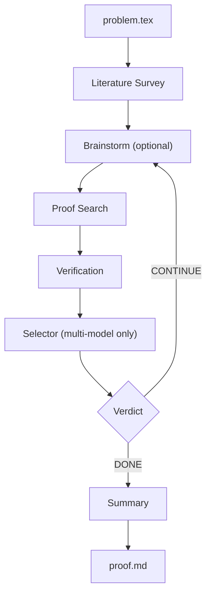
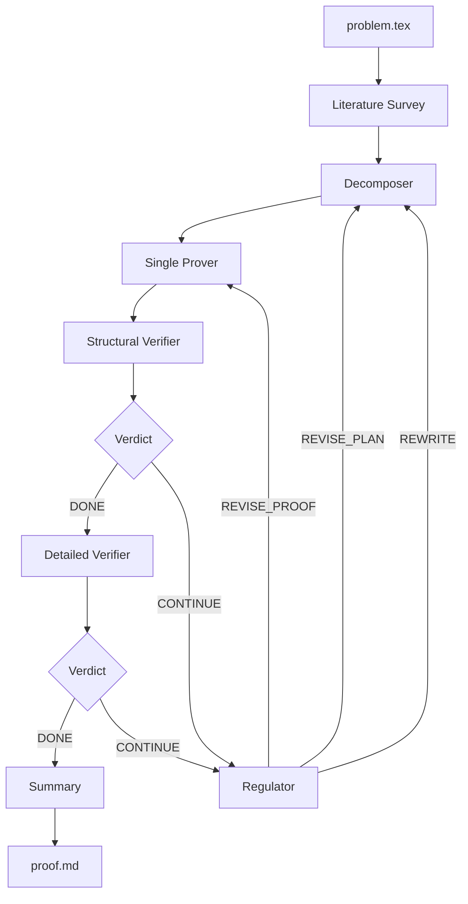

# QED

**Authors:** Chenyang An (<cya.portfolio@gmail.com>) Qihao Ye (<q8ye@ucsd.edu>) Minghao Pan (<mpan2@caltech.edu>) Jiayun Zhang (<landiveo@gmail.com>)

**Paper:** [QED: An Open-Source Multi-Agent System for Generating Mathematical Proofs on Open Problems](https://arxiv.org/abs/2604.24021)

<details>
<summary><b>Citation</b></summary>

```bibtex
@misc{an2026qedopensourcemultiagentgenerating,
      title={QED: An Open-Source Multi-Agent System for Generating Mathematical Proofs on Open Problems},
      author={Chenyang An and Qihao Ye and Minghao Pan and Jiayaun Zhang},
      year={2026},
      eprint={2604.24021},
      archivePrefix={arXiv},
      primaryClass={cs.AI},
      url={https://arxiv.org/abs/2604.24021},
}
```

</details>

QED is a multi-agent pipeline that takes a mathematical problem statement in LaTeX and produces a rigorous natural-language proof. The pipeline orchestrates Claude (and optionally Codex and Gemini) through their respective CLIs via bash subprocesses — no agent framework is used. Both proof search and verification can use any configurable subset of models (Claude, Codex, Gemini) running in parallel. It performs stronger than chatbot versions of various models on math proving tasks, since it uses agentic loops to search and verify math proofs instead of answering in one shot.

<picture>
  <source media="(prefers-color-scheme: dark)" srcset="https://api.star-history.com/svg?repos=proofQED/QED&type=Date&theme=dark" />
  <source media="(prefers-color-scheme: light)" srcset="https://api.star-history.com/svg?repos=proofQED/QED&type=Date" />
  
</picture>

## Math Research Problems Solved by QED, Verified by Domain Experts

### 1. Carleman Weight Function Construction (Inverse Problems / PDE)

**Domain:** Inverse problems, Carleman estimates, wave equations on half-infinite domains.

**What QED solved:** QED found a smooth space-time weight function (with auxiliary parameters) for the wave operator on a half-infinite domain satisfying global pseudoconvexity, growth, and positivity constraints required to validate a Carleman estimate, and gave proofs characterizing the admissible parameter regime ensuring these conditions hold.

**Experts:** Qiao Zhuang (University of Missouri-Kansas City), Qihao Ye (University of California, San Diego), and Zhongqiang Zhang (Worcester Polytechnic Institute). They formulated the question, verified the QED-generated proof, and carried out the dependent mathematical work.

**Workflow:** Experts gave QED the problem: finding a function that satisfies the constraints. QED returned a candidate with proof. Experts found that the constraints were too weak (they had initially given the wrong problem). Experts strengthened the constraints, gave the problem back to QED, and instructed QED to continue the search starting from the previous candidate. QED then returned the final candidate and the proofs. In the entire loop, there was no human intervention besides the experts changing their problem statement once.

**Problems and proofs:** Will be released after the paper is arxived.

<details>
<summary><b>Expert comment (Qiao Zhuang, Qihao Ye, Zhongqiang Zhang)</b></summary>

The use of LLM-based search aims to replace the traditional hand-crafted process of identifying suitable Carleman weight functions for deriving Carleman estimates. This process is often difficult, highly problem-dependent, and time-consuming, and may still fail to produce a valid construction through manual trial. By automating the search over admissible weight functions under the required structural and inequality constraints, the approach has the potential to systematically explore viable candidates, thereby reducing reliance on ad hoc intuition and extensive analytical effort. This is particularly important for inverse problems, where the construction of an appropriate Carleman weight is a central and highly nontrivial step that directly impacts stability and uniqueness results. An LLM-assisted search framework can help identify feasible weight structures, guide the design of admissible functions, and accelerate the development of Carleman-based methodologies, thereby extending their applicability to more complex or less structured problems.

</details>

---

### 2. Nonexistence Result for Critical Transport Equation (Applied Analysis / Fluid PDE)

**Domain:** Applied analysis, fluid mixing, critical transport equations.

**What QED solved:** QED proved that no flow exists satisfying certain properties in a critical case of the transport equation — a negative answer that the domain expert did not expect. The expert had anticipated a constructive proof using Fourier modes, but QED produced a straightforward impossibility proof instead.

**Expert:** Xiaoqian Xu, Assistant Professor of Mathematics at Duke Kunshan University.

**Workflow:** Professor Xu provided this problem (along with three others) to Chenyang An (PhD candidate, UCSD Mathematics), who has no background in the problem domain. Chenyang An ran QED with no human intervention — the entire flow was fully automated. QED proved the statement in Round 1. The proof was sent back to Professor Xu, who verified its correctness.

**Problems and proofs:** [`proved_statements/analysis-Apr-24-2026/`](proved_statements/analysis-Apr-24-2026/) (P3)

<details>
<summary><b>Expert comment (Xiaoqian Xu)</b></summary>

"It's about a critical case of the transport equation; usually people would expect some harder tools to deal with it, but AI just gives a very straightforward proof, which is not something we expected."

"Few people, especially in the field of analysis or PDE, think that AI can really work for analysis problems. These proofs show that AI can really help, even with LLM."

"In the whole process, I only provided the problem description. Chenyang, who is not an analyst, did all the prompt work. The proofs were not obtained through guidance from experts. To be honest, I myself don't know how to solve the problems at all."

See the [full expert comments](proved_statements/analysis-Apr-24-2026/README.md#expert-comments-from-professor-xiaoqian-xu) for complete details.

</details>

---

### 3. Equivalence of Batchelor Scale Condition for Shear Flow (Applied Analysis / Fluid PDE)

**Domain:** Applied analysis, fluid PDE, advection-diffusion equations, turbulence theory, Batchelor scale.

**What QED solved:** Prior work by Professor Xu and collaborator Yupei established a sufficient condition for the existence of the Batchelor scale in shear flow — the first result of its kind. QED proved that this sufficient condition is in fact an equivalent condition, a result that surprised the domain expert, who believed new tools beyond the existing argument would be needed.

**Expert:** Xiaoqian Xu, Assistant Professor of Mathematics at Duke Kunshan University.

**Workflow:** Professor Xu provided this problem (along with three others) to Chenyang An (PhD candidate, UCSD Mathematics), who has no background in the problem domain. Chenyang An ran QED with no human intervention — the entire flow was fully automated. QED proved the statement in Round 3. The proof was sent back to Professor Xu, who verified its correctness.

**Problems and proofs:** [`proved_statements/analysis-Apr-24-2026/`](proved_statements/analysis-Apr-24-2026/) (P4)

<details>
<summary><b>Expert comment (Xiaoqian Xu)</b></summary>

"To my surprise, it shows that the result by Yupei and me is actually an equivalent condition for shear flow — that the Batchelor Scale exists. This is really impressive because both of us agree that there may need some new tools, not just by our argument, to prove that the Batchelor Scale really exists. But AI told us that we don't even need to go deeper into our argument; our result itself is equivalent to the existence of the Batchelor Scale. The proof is relatively straightforward, but it is still nontrivial, and if we don't know the definite answer, we will probably never try it."

"Few people, especially in the field of analysis or PDE, think that AI can really work for analysis problems. These proofs show that AI can really help, even with LLM."

"In the whole process, I only provided the problem description. Chenyang, who is not an analyst, did all the prompt work. The proofs were not obtained through guidance from experts. To be honest, I myself don't know how to solve the problems at all."

See the [full expert comments](proved_statements/analysis-Apr-24-2026/README.md#expert-comments-from-professor-xiaoqian-xu) for complete details.

</details>

---

### 4. Return Probability Asymptotics for Lamplighter Walk on $\mathbb{Z}_2 \wr T_d$ (Probability Theory)

**Domain:** Probability theory, random walks on groups, lamplighter random walks, spectral analysis.

**What QED solved:** For $d \ge 3$ and the switch–walk–switch lamplighter random walk on $\mathbb{Z}_2 \wr T_d$ (where $T_d$ is the infinite $d$-regular tree), QED proved the sharp asymptotic
$$p_{2n}(e,e) = \rho_d^{2n} \exp\!\left[-\bigl(\pi^2(\log(d-1))^2 + o(1)\bigr)\frac{n}{\log^2 n}\right], \quad \rho_d = \frac{2\sqrt{d-1}}{d}.$$
The proof cleverly combines probabilistic constructions with spectral analysis.

**Expert:** Minghao Pan, PhD candidate at Caltech Mathematics Department.

**Workflow:** Minghao Pan provided the problem statement to QED with no further mathematical input. QED ran in decomposition mode and produced the correct proof through multiple rounds of refinement, including substantial changes of proof plan by the decomposition agent. The proof was verified by the expert.

**Problems and proofs:** in /proved_statements/prob-May-15-2026 in this github repo.

<details>
<summary><b>Expert comment (Minghao Pan)</b></summary>

This is a research-level open question in probability theory. Without human mathematical input beyond the problem statement, QED generated a correct proof through multiple rounds of refinement, including substantial changes of proof plan by the decomposition agent. The first result is a solid specialized contribution. Its proof has real mathematical content as it cleverly combines probabilistic constructions with spectral analysis. Its significance appears comparable to work suitable for venues such as the *Electronic Journal of Probability* or *Proceedings of the American Mathematical Society*. The question is in the style of precise probabilistic calculations and estimates.

</details>

---

### 5. Total Variation Asymptotics for Switch-Walk-Switch on $\mathbb{Z}_2 \wr \mathbb{Z}$ (Probability Theory)

**Domain:** Probability theory, random walks on groups, lamplighter random walks, total variation distance.

**What QED solved:** Let $P_t^x$ denote the law at time $t$ of the discrete-time switch-walk-switch walk on $\mathbb{Z}_2 \wr \mathbb{Z}$. For $x=(\mathbf{0},0)$ and $y=(\mathbf{0},2)$, QED proved the asymptotic behavior
$$\|P_t^x - P_t^y\|_{\mathrm{TV}} \asymp t^{-1/2},$$
where $\asymp$ denotes equality up to positive multiplicative constants.

**Expert:** Minghao Pan, PhD candidate at Caltech Mathematics Department.

**Workflow:** Minghao Pan provided the problem statement to QED with no further mathematical input. QED ran in decomposition mode and produced the correct proof through multiple rounds of refinement, including substantial changes of proof plan by the decomposition agent. The proof was verified by the expert.

**Problems and proofs:** in /proved_statements/prob-May-15-2026 in this repo.

<details>
<summary><b>Expert comment (Minghao Pan)</b></summary>

This is a technically nontrivial PhD-level problem in probability theory. Without human mathematical input beyond the problem statement, QED generated a correct proof through multiple rounds of refinement, including substantial changes of proof plan by the decomposition agent. The question is in the style of precise probabilistic calculations and estimates.

</details>


## Standalone Proof Verifier

A standalone tool for checking mathematical proofs or problem statements. Two modes:

- **Verify a proof** (default): Takes a problem + proof pair, classifies difficulty as Easy or Hard, then routes through a 1-agent (Easy) or 3-agent (Hard) verification pipeline. Hard problems go through structural verification first, then detailed verification only if structural passes.
- **Review a problem** (`--problem-only`): Takes just a problem statement and checks whether it is well-defined — reports on clarity, consistency, completeness, and soundness.

Supports Claude, Codex, and Gemini. Provider settings are in the `standalone_verifier` section of `config.yaml`.

### Quick Start

**Verify a proof:**

1. Place your problem statement in `standalone_verifier/problem.txt`.
2. Place the proof in `standalone_verifier/proof.txt`.
3. Run:

```bash
bash run_verifier.sh
```

**Review a problem statement only:**

```bash
bash run_verifier.sh problem.txt --problem-only
```

Reports are written to `standalone_verifier_result/`:

| File | When |
|------|------|
| `report.md` | Always — combined final report |
| `structural_report.md` | Hard problems — structural verifier's raw output |
| `detailed_report.md` | Hard problems, structural PASS — detailed verifier's raw output |

### Options

```bash
# Custom input files
bash run_verifier.sh problem.txt proof.txt

# Problem-only review (no proof needed)
bash run_verifier.sh problem.txt --problem-only

# Override provider for all agents
bash run_verifier.sh problem.txt proof.txt --provider gemini

# Override model
bash run_verifier.sh problem.txt proof.txt --model sonnet
```

---

## How It Works

QED takes a LaTeX problem statement, orchestrates multiple LLMs to search for a proof, verifies the proof through multi-phase checking, and iterates until the proof passes or a round limit is reached. The final output is a rigorous natural-language proof with citations and a summary of the entire proof effort.

The pipeline has two prover modes — **simple** and **decomposition** — described below. Both share the same literature survey (Stage 0), verification system, and summary (Stage 2).

## Getting Started

### Prerequisites

| Dependency | Purpose | Install |
|------------|---------|---------|
| Python 3.11+ | Pipeline runtime | `conda create -n agent python=3.11 -y` |
| `pyyaml` | Config parsing | `pip install pyyaml` |
| [Claude CLI](https://docs.anthropic.com/en/docs/claude-code) | LLM backend | `npm install -g @anthropic-ai/claude-code` |
| [Codex CLI](https://github.com/openai/codex) | LLM backend | `npm install -g @openai/codex` |
| [Gemini CLI](https://github.com/google-gemini/gemini-cli) | LLM backend | `npm install -g @google/gemini-cli` |

You need at least one model CLI installed. Install only the ones you plan to use — every agent role in `config.yaml` can be set to `"claude"`, `"codex"`, or `"gemini"`. Claude is the default if a provider isn't specified.

### Installation

```bash
# 1. Clone the repo
git clone https://github.com/proofQED/QED.git && cd QED

# 2. Install the model CLIs you plan to use (at least one)
npm install -g @anthropic-ai/claude-code   # Claude
npm install -g @openai/codex               # Codex
# Install Gemini CLI per Google's instructions

# 4. Set up Python environment
conda create -n agent python=3.11 -y
conda activate agent
pip install pyyaml

# 5. Verify your CLIs work (send a real prompt, not just --version)
claude "say hello"
codex "say hello"                                  # if using Codex
gemini -m gemini-3.1-pro-preview "say hello"       # if using Gemini

# 6. Edit config.yaml — set your Claude provider and any optional model providers
```

### Quick Start

> **First:** Write your problem statement in **`problem/problem.tex`** (LaTeX format).

```bash
bash run.sh
```

The input file should be a LaTeX problem statement:

```latex
\begin{problem}
Let $f: [0,1] \to \mathbb{R}$ be a continuous function satisfying
$f(0) = f(1) = 0$ and $f(x) > 0$ for all $x \in (0,1)$.
Prove that there exists $c \in (0,1)$ such that
\[
  \frac{f'(c)}{f(c)} = \frac{1}{1-c}.
\]
\end{problem}
```

When the run finishes, your proof is at `<output>/proof.md` and a summary of the proof effort is at `<output>/proof_effort_summary.md`.

## Choosing a Prover Mode

Set the mode in `config.yaml`:

```yaml
prover:
  mode: "simple"          # or "decomposition"
```

### Simple Mode (`prover.mode: "simple"`)

An iterative search-verify loop. Each round: one or more models write a proof, verifiers check it, a verdict agent decides DONE or CONTINUE. Good for problems where a single pass can produce a working proof that just needs iterative refinement.

**Per-round steps:**

1. **Brainstorm** (optional) — Multiple models propose proof strategies in parallel.
2. **Proof Search** — All configured providers write proofs in parallel (or a single provider if multi-model is off).
3. **Verification** — Each proof is checked by all configured verifiers. Structural verification (phases 1-4) runs first, then detailed verification (phase 5).
4. **Selection** (multi-model only) — A selector agent picks the best proof across all providers and verifiers.
5. **Verdict** — Returns DONE (all verifiers passed) or CONTINUE (next round begins with feedback).

The loop runs up to `pipeline.max_proof_iterations` rounds (default: 9).

### Decomposition Mode (`prover.mode: "decomposition"`)

A structured plan-prove-verify-regulate cycle. A decomposer creates a YAML proof plan (a DAG of intermediate claims), a prover executes the plan, verifiers check the result, and a regulator decides what to do on failure. Designed for harder problems that benefit from top-down decomposition.

**Agents** (each independently configurable to use Claude, Codex, or Gemini):

| Agent | Role |
|-------|------|
| **Decomposer** | Creates a YAML proof plan — a DAG of intermediate claims |
| **Single Prover** | Writes a complete proof following the plan |
| **Structural Verifier** | Checks structure, citations, completeness (phases 1-5) |
| **Detailed Verifier** | Step-by-step mathematical correctness (phase 6) |
| **Regulator** | Analyzes failures and decides the next action |
| **Verdict** | Returns DONE or CONTINUE |

**Three-level retry hierarchy** (controlled by the Regulator):

| Level | When | What happens | Default limit |
|-------|------|--------------|---------------|
| **REVISE_PROOF** | Plan is sound, execution has errors | Re-prove with same plan | 2 per revision |
| **REVISE_PLAN** | Plan has structural gaps | Modify the plan, then re-prove | 2 per attempt |
| **REWRITE** | Fundamental approach is flawed | New decomposition from scratch | 2 total |

When a lower-level limit is exhausted, the system automatically escalates. When all limits are exhausted, the regulator writes a failure analysis for human review.

### Comparison

| | Simple | Decomposition |
|---|--------|---------------|
| Best for | Problems solvable by iterative refinement | Hard problems needing structured planning |
| Agents per round | 1-3 (search, verify, verdict) | 6 (decompose, prove, 2x verify, regulate, verdict) |
| Retry strategy | Flat iteration with feedback | 3-level hierarchy (proof / plan / rewrite) |
| Multi-model | Parallel proof search + multi-verifier | Per-agent model selection |

## Configuration

### Claude Provider Setup

If using Claude, configure one of three providers in `config.yaml`:

**Option 1: Subscription (Pro/Max)** — No API key needed. Max required for `opus`.

```yaml
claude:
  provider: "subscription"
  subscription:
    model: "opus"       # or "sonnet", "haiku"
```

**Option 2: AWS Bedrock** — Requires `aws configure`.

```yaml
claude:
  provider: "bedrock"
  bedrock:
    model: "us.anthropic.claude-opus-4-6-v1[1m]"
    aws_profile: "default"
```

**Option 3: Anthropic API Key**

```yaml
claude:
  provider: "api_key"
  api_key:
    model: "claude-opus-4-6"
    key: "sk-ant-..."
```

### Codex and Gemini Setup (Optional)

**Codex** — just install the CLI; it handles its own authentication.

```yaml
codex:
  model: "gpt-5.4"
  reasoning_effort: "xhigh"
```

**Gemini** — requires an API key from [Google AI Studio](https://makersuite.google.com/app/apikey) (or leave `api_key` empty if your Gemini CLI is already logged in with a subscription).

```yaml
gemini:
  model: "gemini-3.1-pro-preview"
  thinking_level: "HIGH"
  api_key: "your-key-here"
```

### Key Config Fields

See [`config.yaml`](config.yaml) for the full reference with comments. The most important fields:

| Field | Description |
|-------|-------------|
| `prover.mode` | `"simple"` or `"decomposition"` |
| `pipeline.max_proof_iterations` | Max rounds for simple mode (default: 9) |
| `pipeline.multi_model.enabled` | Parallel proof search with multiple models |
| `pipeline.multi_model.providers` | Which models run proof search (e.g. `["codex", "gemini"]`) |
| `pipeline.verification_agents.enabled` | Multi-verifier mode |
| `pipeline.verification_agents.providers` | Which models run verification |
| `pipeline.brainstorm.enabled` | Run brainstorm session before proof search |
| `decomposition.models.*` | Per-agent model selection for decomposition mode |
| `decomposition.max_proof_attempts` | REVISE_PROOF limit (default: 2) |
| `decomposition.max_revisions` | REVISE_PLAN limit (default: 2) |
| `decomposition.max_decompositions` | REWRITE limit (default: 2) |

## Pipeline Details

### Stage 0: Literature Survey

A survey agent evaluates the problem's difficulty (Easy / Medium / Hard) and researches the mathematical landscape: classifying the problem domain, identifying applicable theorems, and cataloguing related results. Easy problems get a brief survey; hard problems get the full treatment. Output is saved to `<output>/related_info/` for downstream agents.

### Stage 1: Proof Loop

Either simple mode or decomposition mode runs here, as described above. Both modes share the same verification system.

### Stage 2: Summary

After the proof loop finishes (success or max iterations), a summary agent reads all generated files and writes `proof_effort_summary.md` — a comprehensive record of the entire proof journey.

### Verification System

Verification is split into two phases, each run by a separate agent:

**Structural verification (phases 1-4):**

1. **Problem-Statement Integrity** — Word-by-word comparison: does the proof actually prove the stated problem?
2. **Citation Verification** — Checks every `<cite>` block; fetches source URLs and verifies that quoted statements match the source.
3. **Subgoal Tree Structure** — Validates the proof's decomposition into subgoals for completeness and well-formedness.
4. **Additional Rules** — Applies any human-provided verification criteria from `human_help/` files.

**Detailed verification (phase 5):**

5. **Step-by-step verification** — Fine-grained logical checking with computational verification, subgoal resolution, `<key-original-step>` mismatch analysis, and coverage checks.

In decomposition mode, structural verification also includes a phase checking adherence to the decomposition plan.

### Structured Tags

The proof search agent is required to use two tag formats that the verifier checks:

- **`<cite>...</cite>`** — Every external result (theorem, lemma, etc.) must include: type, title, authors, source URL, exact statement, and usage description. The verifier independently checks each citation's faithfulness.
- **`<key-original-step>...</key-original-step>`** — Every nontrivial, original step must be wrapped in this tag with maximal detail. The verifier flags untagged hard steps and inflated tags.

### How Models are Called

No agent framework is used. All model calls are bash subprocesses:

- **Claude:** `claude -p --output-format json --model <model> <prompt>`
- **Codex:** `codex --search -m <model> exec --json -C <dir> <prompt>`
- **Gemini:** `gemini -m <model> -o json -p <prompt>`

Each call is wrapped in `asyncio.run_in_executor` so the event loop stays non-blocking. Token usage from each call is parsed from JSON stdout and tracked in `TOKEN_USAGE.md` and `token_usage.json`.

## Human Guidance

You can steer both the prover and the verifier while the pipeline runs, at two levels:

**Prover guidance** (read by the proof search agent):

- **Global** (`human_help/additional_prove_human_help_global.md`) — Persistent hints across all rounds. Editable at any time during a run.
- **Per-round** (`<output>/verification/round_N/human_help/additional_prove_human_help_per_round.md`) — Feedback after reviewing round N. Read by round N+1.

**Verification rules** (read by the structural verifier):

- **Global** (`human_help/additional_verify_rule_global.md`) — Persistent verification criteria. Each rule is treated as a hard requirement.
- **Per-round** (`<output>/verification/round_N/human_help/additional_verify_rule_per_round.md`) — Rules after reviewing round N. Read by round N+1.

Per-round `human_help/` directories are created automatically at the start of each round.

## Resuming a Run

If the pipeline is interrupted (crash, Ctrl-C, machine shutdown), just re-run with the same output directory:

```bash
# Same command — the pipeline detects prior progress automatically
bash run.sh /path/to/problem.tex /path/to/output
```

The pipeline will:

- Skip the literature survey if already complete.
- Detect which step within a round was last finished (including parallel steps in multi-model mode).
- Clean up any incomplete state.
- Restore `proof.md` from backup if needed.
- Continue from exactly where it left off.

Decomposition mode has its own resume detection: it scans the `decomposition/` directory hierarchy (attempt → revision → proof) and restores the full state — counters, decomposition plan, attempt history — then continues from the exact interruption point.

## Monitoring a Run

Each pipeline stage writes logs to its own directory under `<output>/`:

| Log file | Location | What it records |
|----------|----------|-----------------|
| `AUTO_RUN_STATUS.md` | `literature_survey_log/`, `verification/`, `summary_log/` | Current pipeline state — iteration, step, timestamps, PID. Overwritten on each update. |
| `AUTO_RUN_STATUS.md.history` | Same directories | Append-only event history with timestamps. |
| `AUTO_RUN_LOG.txt` | Same directories | Full streaming output from all agent calls — tool invocations, model responses, token stats. |
| `TOKEN_USAGE.md` | `<output>/` root | Running total of tokens used, broken down per call and per provider. Updated after every agent call. |
| `STATUS.md` | `decomposition/` (decomposition mode only) | Current decomposition state — attempt, revision, proof number, current activity. |
| `log.txt` | `decomposition/` (decomposition mode only) | Timeline of all decomposition agent calls. |

## UI Mode (Experimental)

A Streamlit web UI is available in `ui/` for real-time monitoring, configuration editing, and human guidance input. It is still under active development — **prefer the command-line method for now**.

```bash
pip install -r ui/requirements.txt
streamlit run ui/app.py
```

## Output Structure

Both modes share the same top-level layout. The Stage 1 artifacts differ by mode.

**Shared (both modes):**

```
<output>/
├── problem.tex                           # Copy of input problem
├── proof.md                              # Final proof
├── proof_effort_summary.md               # Stage 2 summary
├── TOKEN_USAGE.md                        # Human-readable token tracking
├── token_usage.json                      # Machine-readable token tracking
├── related_info/                         # Stage 0 output
│   ├── difficulty_evaluation.md          #   Easy / Medium / Hard
│   └── related_work.md                   #   Applicable theorems, related results
└── summary_log/                          # Stage 2 logs
```

### Simple Mode Output

```
<output>/verification/
├── AUTO_RUN_STATUS.md                    # Current pipeline status
├── AUTO_RUN_LOG.txt                      # Full streaming log
└── round_N/
    ├── proof_before_round.md             # Backup of proof.md before this round
    ├── proof_status.md                   # What the prover tried
    ├── scratch_pad.md                    # Prover's scratch work
    ├── verification_result.md            # Verification report (single-model, single-verifier)
    ├── claude/                           # Per-provider subdirs (when multi-model enabled)
    │   ├── proof.md                      #   This provider's proof
    │   ├── verification_result_claude.md #   Per-verifier reports (when multi-verifier enabled)
    │   ├── verification_result_codex.md
    │   └── verification_result_gemini.md
    ├── codex/                            # Same structure per provider
    │   └── ...
    ├── selection.md                      # Selector agent's pick (multi-model only)
    └── human_help/                       # Per-round guidance (editable between rounds)
        ├── additional_prove_human_help_per_round.md
        └── additional_verify_rule_per_round.md
```

### Decomposition Mode Output

```
<output>/decomposition/
├── STATUS.md                             # Current state (attempt, revision, proof, activity)
├── log.txt                               # Timeline of all agent calls
├── failure_analysis.md                   # Written when all retry limits exhausted
└── attempt_N/
    └── revision_N/
        ├── decomposition.yaml            # The proof plan (DAG of intermediate claims)
        ├── decomposer_response.md        # Raw decomposer output
        └── proof_N/
            ├── proof.md                  # Complete proof
            ├── prover_response.md        # Raw prover output
            ├── scratchpad.md             # Prover's scratch work
            ├── structural_verification.md # Phases 1-5 report
            ├── detailed_verification.md  # Phase 6 report
            └── regulator_decision.md     # REVISE_PROOF / REVISE_PLAN / REWRITE
```

The hierarchy reflects the three retry levels: `attempt_N` (REWRITE) → `revision_N` (REVISE_PLAN) → `proof_N` (REVISE_PROOF).

## File Structure

```
QED/
├── config.yaml                        # Pipeline configuration
├── run.sh                             # Entry point (smoke test + pipeline)
├── clean.sh                           # Cleanup script
│
├── code/
│   ├── pipeline.py                    # Main orchestrator
│   ├── model_runner.py                # Async wrappers for Claude, Codex, Gemini CLIs
│   ├── decomposition_prover.py        # Decomposition-based prover
│   └── smoke_test.py                  # Pre-flight validation
│
├── prompts/                           # Prompt templates ({placeholder} filled at runtime)
│   ├── literature_survey.md
│   ├── proof_search.md
│   ├── proof_verify_structural.md     # Phases 1-4
│   ├── proof_verify_detailed.md       # Phase 5
│   ├── proof_verify_easy.md           # Lightweight verification
│   ├── proof_select.md               # Multi-model selector
│   ├── verdict_proof.md
│   ├── brainstorm.md
│   ├── proof_effort_summary.md
│   └── decomposition-prover/         # Decomposition mode prompts
│       ├── decomposition.md
│       ├── single_prover.md
│       ├── proof_verify_structural.md
│       ├── proof_verify_detailed.md
│       ├── regulator.md
│       └── verdict_proof.md
│
├── problem/
│   └── problem.tex                    # Your problem goes here
│
├── human_help/
│   ├── additional_prove_human_help_global.md
│   └── additional_verify_rule_global.md
│
├── skill/
│   └── super_math_skill.md            # Proof methodology system prompt
│
└── ui/                                # Streamlit web UI (experimental)
    ├── app.py
    ├── config_panel.py
    ├── process_manager.py
    ├── progress_monitor.py
    └── utils.py
```

## Security Warning

This pipeline runs all model CLIs with permissions bypassed (`--dangerously-skip-permissions` for Claude, `--dangerously-bypass-approvals-and-sandbox` for Codex, `--approval-mode yolo` for Gemini). Agents can read, write, and execute files without confirmation.

**Recommendations:**
- Review the prompts in `prompts/` before running.
- Run in an isolated environment (container or VM) when possible.
- Avoid running on machines with sensitive credentials or data.
- Monitor the agent logs (`AUTO_RUN_LOG.txt`) during execution.

## Architecture

### Simple Mode



### Decomposition Mode


